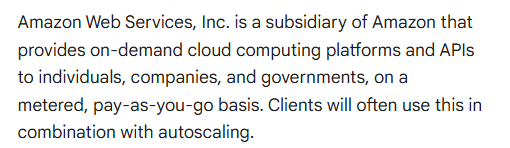
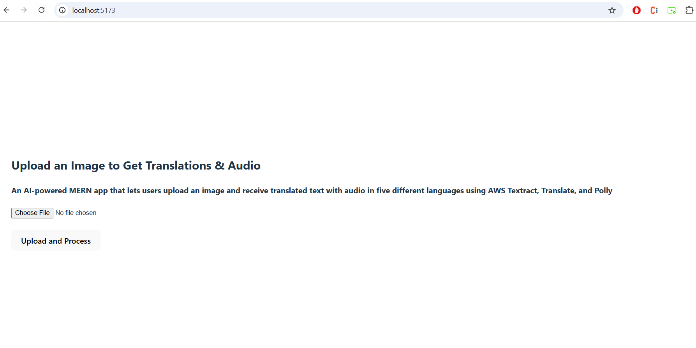
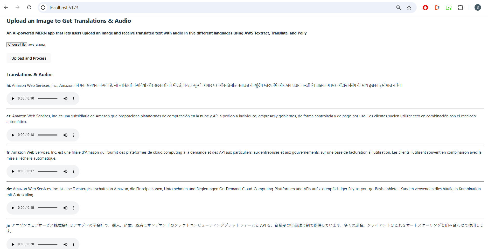

# AI-Powered Image Translator (MERN + AWS)

This project is a full-stack MERN application that allows users to upload an image and receive translated text with audio playback in five different languages. The app leverages multiple AWS AI services to deliver an intelligent, end-to-end solution for real-time image-to-audio translation.

---

### Core Flow

- Users upload an image via the React frontend.
- The backend (Node.js + Express) handles file upload and AWS communication.
- AWS Textract extracts text from the uploaded image.
- AWS Translate translates the extracted text into five target languages.
- AWS Polly converts each translated text into spoken audio.
- The frontend displays translated text and audio playback for each language.

---

### AWS Services Used

- **Amazon Textract** – for extracting text from images
- **Amazon Translate** – for translating extracted text
- **Amazon Polly** – for generating audio files from translated text

All AWS operations are handled securely on the backend. The frontend never directly interacts with AWS services or credentials.

---

### Key Folders and Files

All AWS operations are handled securely on the backend. The frontend never directly interacts with AWS services or credentials.

| Folder/File | Description |
|-------------|-------------|
| `routes/` | Contains route definitions for image upload and processing |
| `uploads/` | Temporarily stores images uploaded from the frontend (`multer` handles this) |
| `public/audio/` | Stores the generated `.mp3` files from AWS Polly (served as static files) |
| `utils/` | Contains core AWS logic broken into utilities: |
| ├── `extractTextFromImage.js` | Invokes **AWS Textract** to extract text from images |
| ├── `translateText.js` | Uses **AWS Translate** to convert text into multiple languages |
| └── `synthesizeSpeech.js` | Generates `.mp3` audio using **AWS Polly** |
| `models/` | (Optional) Placeholder for DB models or future data structures |
| `logs/` | Can be used to store request/error logs for debugging or monitoring |

---

### Deployment Strategy

- The **frontend** (React + Vite) can be deployed to platforms like **Vercel** or **Netlify**.
- The **backend** (Node.js + Express) can be deployed to platforms like **Railway**, **Render**, or **AWS EC2**.
- In production, audio files should be uploaded to an **AWS S3 bucket** instead of being stored locally.
- AWS credentials (`AWS_ACCESS_KEY_ID`, `AWS_SECRET_ACCESS_KEY`, `AWS_REGION`) should be securely provided as **environment variables** using a `.env` file or cloud environment settings — not hardcoded or exposed to the client.

This setup ensures that the app remains secure, scalable, and production-ready.

---

### Visual Steps

#### Step 1: Input Image  

#### Step 2: Upload Image  

#### Step 2: AWS Services Response on Frontend  

---

### 🧾 Author

Built with ❤️ by [@sanchit0496](https://github.com/sanchit0496)
